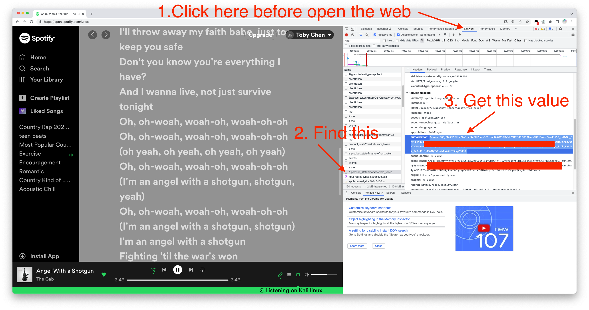

# **spotify-lyric-downloader**
Rips lyrics from currently playing song on Spotify, converts to LRC format for offline playback (e.g Plex, Kodi, MusicBee)
# Disclaimer!!! (Read before use, thanks)  
This software is totally open source code permanently,which is only used for study and conmunication. Any forms of commercial usings is not allowed. Anyone will offered all outcomes if he or she doesn't obey this rule.   
---------------------------------------------------------------------
# Requisites:

> pip install spotipy requests bs4 pyautogui pyperclip datetime importlib
Forgive my carelessness please if there are some modules I forgot to mention, just install it by yourself.
---------------------------------------------------------------------
# How to set up:

· Go to the [Spotify API Dashboard](https://developer.spotify.com/dashboard/applications)

· Create an app and enter ```http://example.com/example``` as the Redirect URI in the settings

· copy client ID and secret from Spotify API Dashboard and put them into lyricdownloader.py

· Sign into Spotify and listen to any song you like.

· open the browser and open the developer tool(Hot key is F12 in Chrome), and go to https://open.spotify.com/lyrics, find the authrization value following the picture below. Then close the browser. Remember, once you get the authrization, don't open https://open.spotify.com/lyrics in a new web, or it will generate a new one and the old one will be expired. As long as you don't open a new web, this can maintain a long time. Just use client or the web you first opened to listen to music.


· Run converter.py in a cmd or git-bash terminal.

· It will redirect you to a link based off your URI, copy everything but ```http://example.com/example``` from the url and paste it into the console. Then you can close the browser.

  
---------------------------------------------------------------------

# How to use:

· Listen to a song on Spotify (any client works).

· run converter.py in Windows cmd or Mac terminal.

· Wait about 10 seconds.

· Once complete, check "Lyrics" folder for grouping by artist, album, and track number and title. Enjoy yourself!
